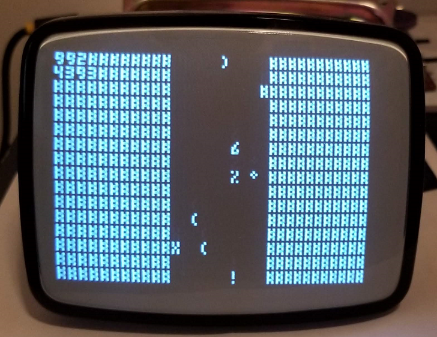

# InitialASCII

Small arduino program that display a self playing game where a car (the character X) tries to avoid obstacles on the road.
It is shown on a composite compatible display such as an old CRT/LCD TV.
Useless but fun to look at for 5 minutes.

## How to use
- Wire an arduino like on this [page](https://playground.arduino.cc/Main/TVout/). (you will need something like [this](https://www.amazon.ca/Poyiccot-Speaker-Terminal-Female-Spring/dp/B077JQMPPZ/ref=sr_1_4?keywords=rca+plug&qid=1555456684&s=gateway&sr=8-4))

- Setup the Arduino IDE and install [tvout](https://github.com/Avamander/arduino-tvout)
- Open initialASCII.ino in the arduino IDE and flash it to your arduino

## Requirements
- Some Arduino board (tested on a UNO)
- [An RCA connector](https://www.amazon.ca/Poyiccot-Speaker-Terminal-Female-Spring/dp/B077JQMPPZ/ref=sr_1_4?keywords=rca+plug&qid=1555456684&s=gateway&sr=8-4))
- [tvout](https://github.com/Avamander/arduino-tvout)